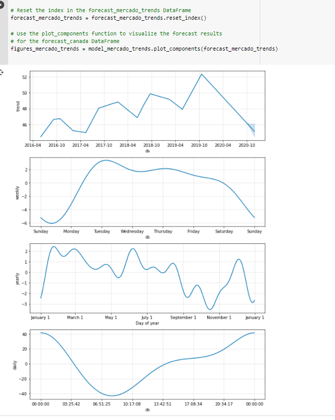

# Forecasting-Net-Prophet-With-Time-Series
Use time series data to find out the ability to predict search traffic can translate into the ability to successfully trade the stock. We will leverage Google Colab and Facebook Prophet to predict search traffic. 

The steps for this project are divided into the following sections:

1. Find unusual patterns in hourly Google search traffic 
2. Mine the search traffic data for seasonality 
3. Relate the search traffic to stock price patterns
4. Create a time series model with Prophet
5. Forecast revenue by using time series models


---

## Technologies

Instead of running Facebook Prophet on your local machine, using Google Colab would be ideal to run Facebook Prophet. You can 'Upload' the Jupyter notebook after launching https://colab.research.google.com

Need to install and import the following libraries and dependencies in Google Colab:

```
!pip install pystan
!pip install fbprophet
!pip install hvplot
!pip install holoviews

import pandas as pd
import holoviews as hv
from fbprophet import Prophet
import hvplot.pandas
import datetime as dt
%matplotlib inline

```


## Usage

You will need to clone the repo so that you can run the application:

```
 git clone https://github.com/locthai2002/Forecasting-Net-Prophet-With-Time-Series.git
```
You also need to upload the three .csv files in the Resources folder to run the application:

```
google_hourly_search_trends.csv
mercado_daily_revenue.csv
mercado_stock_price.csv
```

Here are some screenshots from running the application:

## Find unusual patterns in hourly Google search traffic


## Mine the search traffic data for seasonality


## Relate the search traffic to stock price patterns


## Create a time series model with Prophet





## Forecast revenue by using time series models


---

## Contributors

Loc Thai -- www.linkedin.com/in/loc-thai-69b8a2141
Phone: 415.400.9998

---

## License

MIT
